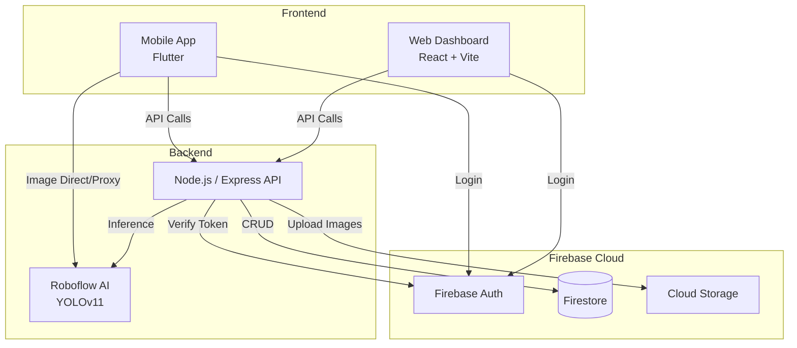

# 🏭 ICEM Quality Control


## 📋 Description du Projet

Le projet **ICEM Quality Control** est un système complet de digitalisation du contrôle qualité industriel pour la production de faisceaux de câbles. Il remplace les processus manuels sur papier par une solution moderne, intégrée et intelligente.

Il se compose de :
1. **Application Mobile (Flutter)** : Destinée aux techniciens sur le terrain pour exécuter les checklists d'inspection (électrique et visuelle) et prendre des photos des anomalies.
2. **Dashboard Web (React)** : Destiné aux responsables qualité et à la direction pour le suivi en temps réel de la production, la consultation des rapports et la gestion des utilisateurs.
3. **Backend API (Node.js)** : Orchestre les données, gère les permissions et la sécurité.
4. **Intelligence Artificielle (Roboflow / YOLOv11)** : Analyse les photos prises par les techniciens pour détecter automatiquement les défauts d'assemblage.

---

## 🏗️ Architecture Technique



- **Mobile** : Flutter, Provider (State Management), Camera, Firebase Auth
- **Web** : React 19, Vite, Tailwind CSS 4, Recharts, jsPDF
- **Backend** : Node.js, Express, Firebase Admin SDK, Nodemailer (Alertes Email)
- **Base de données** : Firebase Firestore (NoSQL) & Cloud Storage (Images)
- **IA** : Roboflow Inference API (Modèle de détection d'objets)

---

## 🚀 Guide de Démarrage

### Prérequis
- [Node.js](https://nodejs.org/) (v18+)
- [Flutter SDK](https://flutter.dev/docs/get-started/install) (v3.10+)
- Projet [Firebase](https://console.firebase.google.com/) configuré (Firestore, Storage, Auth)
- Compte [Roboflow](https://roboflow.com/) pour la détection d'IA

### 1. Configuration du Backend

```bash
cd backend
npm install
```
- Copiez `.env.example` en `.env` et renseignez vos clés (SMTP, Roboflow).
- Placez votre fichier `serviceAccountKey.json` Firebase dans le dossier `backend/`.
- Lancez le serveur : `npm run dev` (Port par défaut : 5000)

### 2. Configuration du Dashboard Web

```bash
cd frontend-web
npm install
```
- Copiez `.env.example` en `.env` et ajoutez votre configuration Firebase client.
- Lancez l'application : `npm run dev` (Port par défaut : 5173)

### 3. Configuration de l'App Mobile

```bash
flutter pub get
```
- Configurez Firebase pour Flutter avec `flutterfire configure`.
- Lancez l'application sur un émulateur ou appareil physique : `flutter run --dart-define=ROBOFLOW_API_KEY=votre_cle`

---

## 🔒 Sécurité & Permissions (RBAC)

Le système implémente un contrôle d'accès basé sur les rôles :
- **Technicien** : Accès mobile uniquement (Inspections, détection IA).
- **Manager (Qualité)** : Dashboard web (Ordres, anomalies, rapports).
- **Direction** : Dashboard web (Vue globale, statistiques, tendances).
- **Admin** : Accès total (Gestion des utilisateurs, configurations).

## 📄 Licence
Ce projet a été réalisé dans le cadre d'un Projet de Fin d'Études (PFE). Tous droits réservés.
