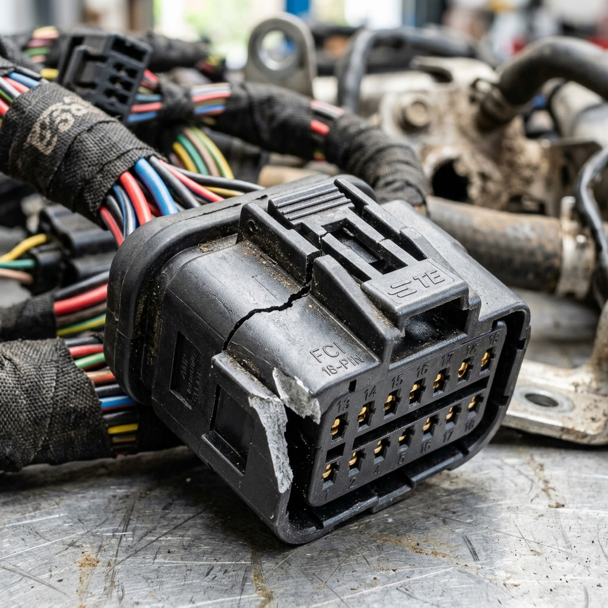
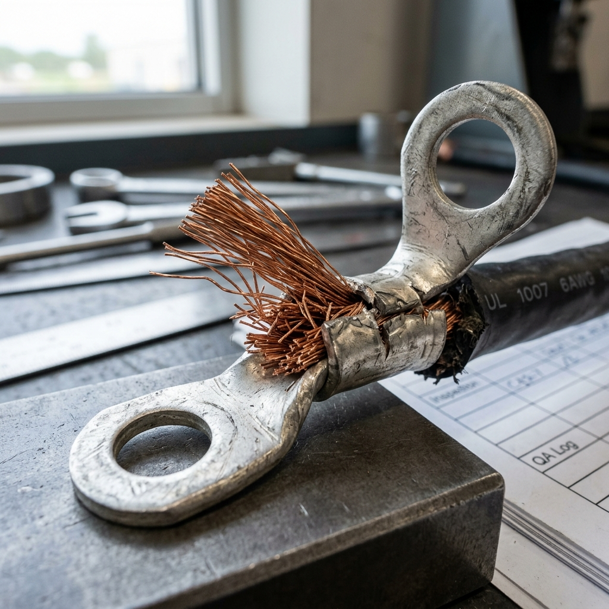

# Spécifications Techniques : Fabrication d'un Câble de Test avec Anomalies
## Projet de Fin d'Études — Système Intelligent de Contrôle Qualité ICEM

| Métadonnées | Informations |
|-------------|--------------|
| **Destinataire** | Encadrant de l'entreprise ICEM / Responsable Production |
| **Auteurs** | Maram Laouini & Riheme Mhemdi |
| **Sujet** | Demande de fabrication d'un échantillon physique de câble avec défauts |
| **Projet** | Système de contrôle qualité assisté par Vision IA (PFE 2025/2026) |
| **Objectif** | Validation et démonstration en temps réel devant le jury de soutenance |
| **Date** | 26 mai 2026 |

---

> [!IMPORTANT]
> **Contexte de la demande**
> Dans le cadre du déploiement de notre modèle d'intelligence artificielle (**YOLOv11** entraîné via **Roboflow**), nous devons effectuer une démonstration en direct (Live Demo) devant le jury de soutenance. 
> 
> Afin de valider la détection en temps réel sur l'application mobile des techniciens et le tableau de bord web, nous sollicitons la fabrication d'un **câble prototype (Golden Cable)** comportant volontairement les anomalies et défauts listés ci-dessous. Ce câble doit être le plus proche possible des conditions réelles de production de l'usine ICEM.

---

## 1. Tableau Récapitulatif des Défauts à Intégrer

Le tableau ci-dessous liste l'ensemble des anomalies que notre modèle IA a été entraîné à détecter. Les codes de défaut correspondent aux fiches d'anomalies du système.

| N° | Composant | Description du Défaut | Classe Roboflow (Dataset) | Code Système | Sévérité |
|:--:|:----------|:----------------------|:--------------------------|:------------:|:--------:|
| **1** | **Terminal / Broche** | Composant mal inséré (semi-verrouillé) | `composant_mal_insere` | **P** | **Critique** |
| **2** | **Connecteur** | Cavité vide (fil manquant dans le connecteur) | `composant_manquant` | **P** | **Critique** |
| **3** | **Connecteur** | Boîtier plastique fissuré ou clip cassé | `connecteur_anomalie` | **J** | **Critique** |
| **4** | **Cosse métallique** | Cosse pliée, tordue ou mal sertie | `cosse_anomalie` | **A** | **Majeur** |
| **5** | **Gaine de protection** | Tube annelé déchiré ou mal positionné | `protection_anomalie` | **M** | **Majeur** |
| **6** | **Ruban adhésif (Scotch)**| Ruban desserré, mal enroulé ou effiloché | `scotche_anomalie` | **S** | **Mineur** |
| **7** | **Étiquette d'identification**| Étiquette déchirée, plissée ou absente | `etiquette_anomalie` | **V** | **Mineur** |

---

## 2. Fiches de Détails & Consignes de Fabrication

> [!TIP]
> *Note pour l'atelier : Les photos ci-dessous servent de référence visuelle. Le câble doit regrouper ces différents défauts sur ses extrémités et sa longueur pour pouvoir être inspecté en un seul passage ou par zones.*

### 2.1 Défaut 1 : Composant Mal Inséré (`composant_mal_insere`)
* **Composant affecté :** Connecteur femelle et broche métallique (terminal).
* **Consigne de fabrication :** Insérer la broche dans le connecteur plastique sans aller jusqu'au "clic" de verrouillage. La broche doit ressortir légèrement de la face arrière du connecteur d'environ 3 à 5 mm, laissant apparaître la partie sertie ou le cuivre.
* **Photo de référence :**
  

---

### 2.2 Défaut 2 : Composant Manquant (`composant_manquant`)
* **Composant affecté :** Boîtier du connecteur.
* **Consigne de fabrication :** Laisser délibérément une des cavités du connecteur (prévue pour être câblée) complètement vide. Aucun fil ni terminal ne doit y être inséré.
* **Photo de référence :**
  

---

### 2.3 Défaut 3 : Anomalie Connecteur (`connecteur_anomalie`)
* **Composant affecté :** Boîtier plastique du connecteur (moulage).
* **Consigne de fabrication :** Utiliser un connecteur rebuté présentant une fissure physique sur le corps plastique, ou couper/casser la languette de verrouillage supérieure (clip de fixation).
* **Photo de référence :**
  

---

### 2.4 Défaut 4 : Anomalie Cosse (`cosse_anomalie`)
* **Composant affecté :** Cosse métallique de masse (cosse ronde ou plate).
* **Consigne de fabrication :** Réaliser un sertissage non conforme en pliant la cosse métallique à un angle d'environ 45° ou 90°, ou laisser des brins de cuivre dépasser de manière désordonnée en dehors du fût de sertissage (sertissage lâche).
* **Photo de référence :**
  

---

### 2.5 Défaut 5 : Anomalie Protection (`protection_anomalie`)
* **Composant affecté :** Gaine annelée ou tube de protection thermorétractable.
* **Consigne de fabrication :** Créer une entaille ou une déchirure longitudinale d'environ 2 à 3 cm sur le tube annelé, ou laisser un espace vide (zone non protégée) de quelques centimètres exposant les fils de couleur au niveau d'une jonction.
* **Photo de référence :**
  

---

### 2.6 Défaut 6 : Anomalie Scotch (`scotche_anomalie`)
* **Composant affecté :** Ruban adhésif d'enrubannage du faisceau.
* **Consigne de fabrication :** Enrouler le scotch de manière lâche à une extrémité, en laissant les derniers tours se décoller (ruban effiloché/peeling) pour simuler un vieillissement ou une mauvaise application manuelle.
* **Photo de référence :**
  

---

### 2.7 Défaut 7 : Anomalie Étiquette (`etiquette_anomalie`)
* **Composant affecté :** Étiquette d'identification avec code-barres.
* **Consigne de fabrication :** Coller une étiquette d'identification qui est partiellement déchirée, pliée sur elle-même (rendant le code-barres illisible), ou collée de travers (misaligned).
* **Photo de référence :**
  

---

## 3. Recommandations pour la Démonstration

Pour garantir le succès des tests lors de la soutenance :
1. **Variété des couleurs :** Il est préférable que les fils électriques internes soient de couleurs bien distinctes (rouge, bleu, jaune/vert, noir) pour faciliter le contraste et la détection par l'IA.
2. **Marquage clair :** Le câble de test doit porter un numéro d'ordre de fabrication fictif (ex: `OF-TEST-JURY-2026`) imprimé sur une étiquette non défectueuse à l'une de ses extrémités pour la phase d'initialisation sur l'application mobile.
3. **Dimensions standard :** Une longueur totale de **50 cm à 1 mètre** est idéale pour être facilement manipulable sous la caméra de test de la station ou du smartphone.

---

> [!NOTE]
> Nous vous remercions chaleureusement pour votre soutien technique continu dans la réalisation de ce projet. Ce câble de test physique constituera une preuve concrète du bon fonctionnement de notre solution industrielle devant les membres du jury.
